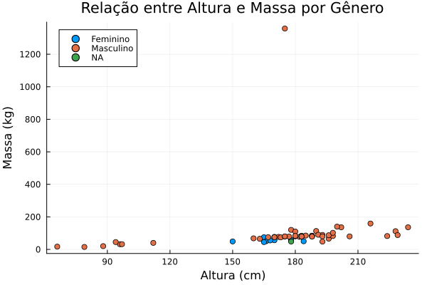

# Análise de Dados do Star Wars em Julia

Este projeto envolveu a análise de dados da franquia Star Wars usando uma base de dados de personagens e suas características. A análise foi realizada usando a linguagem de programação Julia, com a ajuda das bibliotecas DataFrames.jl e StatsBase.jl.

## Introdução

A base de dados do Star Wars contém informações sobre diversos personagens, incluindo detalhes como altura, massa, gênero e espécie. O objetivo deste projeto foi realizar várias análises exploratórias e estatísticas sobre esses dados.

## Etapas do Projeto

O projeto foi dividido em várias etapas, incluindo:

1. Importação dos Dados: Os dados foram importados a partir de um arquivo CSV usando a biblioteca DataFrames.jl.

2. Limpeza dos Dados: Foram realizadas operações de limpeza, como tratamento de valores ausentes e conversão de tipos de dados.

3. Análise de Gênero: Calculamos o número de personagens de cada gênero e sua porcentagem em relação ao total.

4. Análise de Espécies: Similarmente, calculamos o número de personagens de cada espécie e sua porcentagem em relação ao total.

5. Análise de Altura e Massa: Calculamos a altura e a massa média por gênero e apresentamos os resultados.

6. Conclusão: Resumimos os principais insights obtidos a partir da análise dos dados.

## Resultados

Os resultados da análise revelaram várias informações interessantes sobre a franquia Star Wars, incluindo a distribuição de personagens por gênero e espécie, bem como as médias de altura e massa por gênero.


#### Tabela de Quantidade e Porcentagem por Gênero
| genero     | quantidade | porcentagem |
|------------|------------|-------------|
| Masculino  | 66         | 75.8621     |
| Feminino   | 17         | 19.5402     |
| NA         | 4          | 4.5977      |


#### Tabela da Altura e Massa média por Gênero
| genero   | altura_media | massa_media |
|----------|--------------|-------------|
| Masculino| 176.516      | 106.147     |
| Feminino | 164.688      | 54.6889     |
| NA       | 181.333      | 48.0        |



O outlier deste plot é o Jabba Desilijic Tiure (Hutt), que possui uma massa de 1358 kg e uma altura de 175 cm.

## Como Executar o Código

Se você deseja executar o código utilizado nesta análise, siga os seguintes passos:

1. Instale Julia em seu ambiente: [Julia Installation Guide](https://julialang.org/downloads/)

2. Instale as bibliotecas DataFrames.jl e StatsBase.jl usando o gerenciador de pacotes do Julia:

   ```julia
   using Pkg
   Pkg.add("DataFrames")
   Pkg.add("StatsBase")
   ``` 


1. Baixe os dados da base do Star Wars e o código de análise.

2. Execute o código em um ambiente Julia.

## Conclusão

Este projeto demonstrou como realizar análises de dados básicas usando a linguagem Julia e bibliotecas especializadas. Os resultados fornecem insights interessantes sobre os personagens da franquia Star Wars.

Se você tiver alguma dúvida ou sugestão, sinta-se à vontade para entrar em contato.

